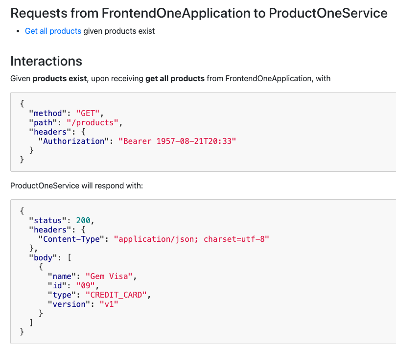
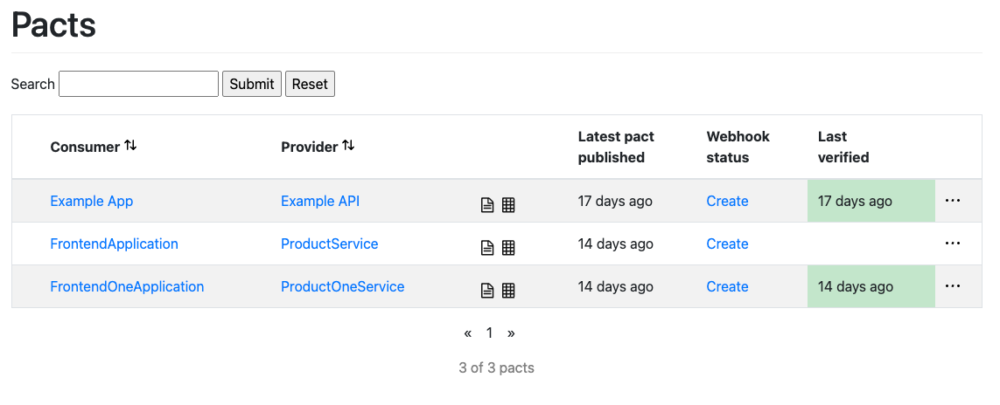

#ELK 설치 8.9.1


#Docker Compose
https://github.com/lswteen/docker-elk
```dockerfile
version: '3.7'

services:

  # The 'setup' service runs a one-off script which initializes users inside
  # Elasticsearch — such as 'logstash_internal' and 'kibana_system' — with the
  # values of the passwords defined in the '.env' file. It also creates the
  # roles required by some of these users.
  #
  # This task only needs to be performed once, during the *initial* startup of
  # the stack. Any subsequent run will reset the passwords of existing users to
  # the values defined inside the '.env' file, and the built-in roles to their
  # default permissions.
  #
  # By default, it is excluded from the services started by 'docker compose up'
  # due to the non-default profile it belongs to. To run it, either provide the
  # '--profile=setup' CLI flag to Compose commands, or "up" the service by name
  # such as 'docker compose up setup'.
  setup:
    profiles:
      - setup
    build:
      context: setup/
      args:
        ELASTIC_VERSION: ${ELASTIC_VERSION}
    init: true
    volumes:
      - ./setup/entrypoint.sh:/entrypoint.sh:ro,Z
      - ./setup/lib.sh:/lib.sh:ro,Z
      - ./setup/roles:/roles:ro,Z
    environment:
      ELASTIC_PASSWORD: ${ELASTIC_PASSWORD:-}
      LOGSTASH_INTERNAL_PASSWORD: ${LOGSTASH_INTERNAL_PASSWORD:-}
      KIBANA_SYSTEM_PASSWORD: ${KIBANA_SYSTEM_PASSWORD:-}
      METRICBEAT_INTERNAL_PASSWORD: ${METRICBEAT_INTERNAL_PASSWORD:-}
      FILEBEAT_INTERNAL_PASSWORD: ${FILEBEAT_INTERNAL_PASSWORD:-}
      HEARTBEAT_INTERNAL_PASSWORD: ${HEARTBEAT_INTERNAL_PASSWORD:-}
      MONITORING_INTERNAL_PASSWORD: ${MONITORING_INTERNAL_PASSWORD:-}
      BEATS_SYSTEM_PASSWORD: ${BEATS_SYSTEM_PASSWORD:-}
    networks:
      - elk
    depends_on:
      - elasticsearch
      - kibana
      - logstash

  elasticsearch:
    build:
      context: elasticsearch/
      args:
        ELASTIC_VERSION: ${ELASTIC_VERSION}
    volumes:
      - ./elasticsearch/config/elasticsearch.yml:/usr/share/elasticsearch/config/elasticsearch.yml:ro,Z
      - elasticsearch:/usr/share/elasticsearch/data:Z
    ports:
      - 9200:9200
      - 9300:9300
    environment:
      node.name: elasticsearch
      ES_JAVA_OPTS: -Xms512m -Xmx512m
      # Bootstrap password.
      # Used to initialize the keystore during the initial startup of
      # Elasticsearch. Ignored on subsequent runs.
      ELASTIC_PASSWORD: ${ELASTIC_PASSWORD:-}
      # Use single node discovery in order to disable production mode and avoid bootstrap checks.
      # see: https://www.elastic.co/guide/en/elasticsearch/reference/current/bootstrap-checks.html
      discovery.type: single-node
    networks:
      - elk
    restart: unless-stopped

  logstash:
    build:
      context: logstash/
      args:
        ELASTIC_VERSION: ${ELASTIC_VERSION}
    volumes:
      - ./logstash/config/logstash.yml:/usr/share/logstash/config/logstash.yml:ro,Z
      - ./logstash/pipeline:/usr/share/logstash/pipeline:ro,Z
    ports:
      - 5044:5044
      - 50000:50000/tcp
      - 50000:50000/udp
      - 9600:9600
    environment:
      LS_JAVA_OPTS: -Xms256m -Xmx256m
      LOGSTASH_INTERNAL_PASSWORD: ${LOGSTASH_INTERNAL_PASSWORD:-}
    networks:
      - elk
    depends_on:
      - elasticsearch
    restart: unless-stopped

  kibana:
    build:
      context: kibana/
      args:
        ELASTIC_VERSION: ${ELASTIC_VERSION}
    volumes:
      - ./kibana/config/kibana.yml:/usr/share/kibana/config/kibana.yml:ro,Z
    ports:
      - 5601:5601
    environment:
      KIBANA_SYSTEM_PASSWORD: ${KIBANA_SYSTEM_PASSWORD:-}
    networks:
      - elk
    depends_on:
      - elasticsearch
    restart: unless-stopped

networks:
  elk:
    driver: bridge

volumes:
  elasticsearch:
```

```properties
ELASTIC_VERSION=8.9.1

## Passwords for stack users
#

# User 'elastic' (built-in)
#
# Superuser role, full access to cluster management and data indices.
# https://www.elastic.co/guide/en/elasticsearch/reference/current/built-in-users.html
ELASTIC_PASSWORD='jk1234'

# User 'logstash_internal' (custom)
#
# The user Logstash uses to connect and send data to Elasticsearch.
# https://www.elastic.co/guide/en/logstash/current/ls-security.html
LOGSTASH_INTERNAL_PASSWORD='jk1234'

# User 'kibana_system' (built-in)
#
# The user Kibana uses to connect and communicate with Elasticsearch.
# https://www.elastic.co/guide/en/elasticsearch/reference/current/built-in-users.html
KIBANA_SYSTEM_PASSWORD='jk1234'

# Users 'metricbeat_internal', 'filebeat_internal' and 'heartbeat_internal' (custom)
#
# The users Beats use to connect and send data to Elasticsearch.
# https://www.elastic.co/guide/en/beats/metricbeat/current/feature-roles.html
METRICBEAT_INTERNAL_PASSWORD='jk1234'
FILEBEAT_INTERNAL_PASSWORD='jk1234'
HEARTBEAT_INTERNAL_PASSWORD='jk1234'

# User 'monitoring_internal' (custom)
#
# The user Metricbeat uses to collect monitoring data from stack components.
# https://www.elastic.co/guide/en/elasticsearch/reference/current/how-monitoring-works.html
MONITORING_INTERNAL_PASSWORD='jk1234'

# User 'beats_system' (built-in)
#
# The user the Beats use when storing monitoring information in Elasticsearch.
# https://www.elastic.co/guide/en/elasticsearch/reference/current/built-in-users.html
BEATS_SYSTEM_PASSWORD='jk1234'
```


## Elasticsearch
http://localhost:9200/


## Kibana
http://localhost:5601/app/home#/


# 분석 마인드맵


```text
https://www.knotend.com/g/a#N4IgzgpgTglghgGxgLwnARgiAxA9lAWxAC5QA7XAEwjBPIHYAWADgE56OBGOkBDCBCRABRADIBpAASASocC7C5IA6ZAGrQwMXGUnMAdKx3cANCADGuBPiGYArhBABfY2QBsABlaMATAFZW3nnzoAkIAygAOsGQA5ui4uAAukoA2tYCMg4A844A6HZIAInDxcJIACtaYMCZKABaekgDUkgCChQCSIMZmFlBWCLYOTs6s7vSc3tykvPyCxCCAheOAKvOANZ2AIqOSgAtjgLyrkoAOE4Axa5KAIKsZgDtDgAATkoAhvYC4g0qHgC5zgAc10oAX85IAKtnZgJQ9gLtDmZKAI5OASNXWqZzJYplEoHAAJ69EBkLwAZm8jHozHoAQmQjEUjkyUAqbPA9pgkA2OyOOHMbzOTicZicZwYoKTEDhSIxOKJVK-EJoKAmCqSHlQABu0GSKUJoM64MhMPJZE4rE4rmG9FYjOCU1EuCiYHyYAF0kANguAXs7AB1LkkAASuASYHAB7jko6Qgh0NhZHork8zgRjH6GuZ2t1+sNpotgFzJs52h3E51ypye5zebyuNh+oQBvVwA2SQAkg4ANOaj0pAYWsUDCWFdTF8wwR6LGgU1Ij4erKkDgfIFeYLQmLpfL8oRA+Yzh86rrmKm4hg6DgZAKnbaUu7JbLZL6CM4jFY-VroHrzNy+UkADkqBBJE0yNQAB45wAjNV2ZS7+yMPOwEampgeCifqJJABVdgATTYADIuAIOdOa5pIJjQBA6BQLglTxPEYRgMQAD0qFRDA8QVCUOhmAQqEIAQEBkBAqBgKhUFQDBcGodRWCZjQD4gDGrqeAMjDeJ4zCeB+ICAKhrgA7C4AMYPnBcgAMdce+AwMxrHyswjCuEiniuHxgCbzYAGuOAC2jgA1A4AIBOSIAM52ACct4mybKFaMCw9CeIw75jkyQiABzdgAJ44AL6OCvEbKvLgADWJEoGK2aAKgT5lPk4KJ+Apw58QAEjAUQCqIECiggkgAMJICRiRKKyMDRDkeQFBe15bLsjQtAujqPrGcJIj6rjOApcUJUlKUCBlWVkDlZB5QVX7npeEA3oAGEPBQ0zRhbVLj0EmnBqqMu7jo2mbxC2vL8oVh4-megCPLYAuh1Ta6zBIuu7jMHxwhNmtJitu2W3fqeZVHfKarOMOnCepd13rW2m0DTtkhjS95IQJQURMcQADaUNwkwbAcEMwIuO4Xi+P4AC6hiw26LDsFwyP9IMwzcFjOPw-jSMRZ49WouiZNw3jiNGBSVI0nSDIMyjHgjv4TiKsqqrqlzbg8+jyPup63q+lziLInTyPxomybC9jcJyyiaIS5xSreDWICyzT8ta04A4IkOI4G2r8JG5r6JrhuW7sFbOMawrpsvpu9DvobtMm3C7GuJx3G8b7xv2xSinKapYd29r1m2T71uUtStL0sjkXeNFofJ2zacMh7DVNYwLtwgLKreGqhOzSqC2lwqSoV1XTgnXryqsBdXPl0LEtbh9X0Yxj5JQQgCAAOowJQ2EkLZrhtAICCxRArXxCQLDz6PhRwJQlD5VEJBIk4p4APJQNQbIkOTTME30qO84TAzsCTGe2+7rOpxzyPd5X6pOJLXo+l-gHd6ysUx-x1tWCOZAzYW18ITdcm5tzIyRIqL2744wcS4jxZGCklJcVUuAhOdkM5qizj6Xihc3DF2rnNOuLdTrtwun-PunhPqc3sEAA
```

#Client
- Springboot to Logstash
- Springboot for Elasticsearch Client

# 설치 방법에 대한 절차
Task 항목 도출후 진행 필요