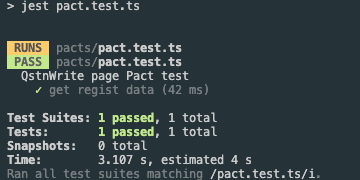

# Pact 실제 서비스 구현 이슈
Pact Consumer, Provider을 직접 프론트앤드 개발자와 함께 POC 형태 프로젝트를 진행하게되었습니다.  
실제로 처음 Pact Contract Test를 진행하게되면 얼마나 삽질을 할것인가에 대해서 어느정도 경험치가 나온것 같아서 의미있는 시간이었고 가장 의미있는 글을 쓸수 있을것 같습니다.

## 요구사항
Frontend에서 사용할 API에 대해서 
Cunsumer(Frontend) 에서 Pact Contract Test 개발하고 Publish 된 Pact 계약 파일을 기반으로
Provider(Backend) 에서 Status 검증 Test 진행하는 과정을 POC 목적으로 진행하였습니다.
 

## POC 실험자 : 
프론트앤드 개발자 : 주니어 개발자 (1-3년차)  
백앤드 개발자 : 16년이상 개발자 (엉덩이로 5년, 입으로 5년, 실 개발 6년 개발자)

```shell
// pact package 설치
pnpm add -D @pact-foundation/pact @pact-foundation/pact-core
// jest 설치
pnpm add -D @types/jest @testing-library/jest-dom @testing-library/react @testing-library/user-event ts-jest jest jest-environment-jsdom
// axios 설치
pnpm add -D axios
```


# Frontend Type Script Consumer Code 개발 및 Public

### <root>/jest.config.js
```js

module.exports = {
  preset: 'ts-jest',
  testEnvironment: 'jsdom',
  testMatch: ['<rootDir>/tests/**/*.test.(js|jsx|ts|tsx)', '<rootDir>/pacts/**/*.test.(js|jsx|ts|tsx)'],
  moduleNameMapper: {
    '^@/(.*)$': '<rootDir>/$1',
  },
  setupFilesAfterEnv: ['@testing-library/jest-dom'],
};
```

### <root>/jest-dom-d.ts
```js
declare namespace jest {
  interface Matchers<R, T> {
    toBeInTheDocument(): R;
  }
}
```

### test code
```ts
/**
 * @jest-environment node
 */
import path from 'path';
import { MatchersV3, PactV3, SpecificationVersion } from '@pact-foundation/pact';
import { testFetch } from './api';
 
const provider = new PactV3({
  consumer: 'QstnWrite',
  provider: 'regist',
  logLevel: 'warn',
  dir: path.resolve(process.cwd(), 'pacts'),
  spec: SpecificationVersion.SPECIFICATION_VERSION_V3,
});
const { like, string, eachLike } = MatchersV3;
 
describe('QstnWrite page Pact test', () => {
  it('get regist data', async () => {
    provider.addInteraction({
      states: [{ description: 'I want data when I enter the QstnWrite page' }],
      uponReceiving: 'regist data',
      withRequest: {
        method: 'GET',
        path: '/regist',
        headers: {
          'Content-Type': 'application/json',
        },
      },
      willRespondWith: {
        status: 200,
        headers: {
          'Content-Type': MatchersV3.regex(
            'application/json(;\\s?charset=[\\w\\-]+)?',
            'application/json; charset=utf-8',
          ),
        },
        body: {
          resumeData: like({
            highSchoolCode: string('FFFFF385'),
            highSchoolName: string('스타고등학교'),
            universityCode: string('HE119'),
            universityName: string('스타대학교'),
            bizJobTypeCode: string('7832201'),
            bizJobTypeName: string('테스트'),
          }),
          myJobs: eachLike({
            code: string('1320412'),
            name: string('쇼핑몰·오픈마켓·소셜커머스'),
          }),
          mySchoolMates: eachLike({
            schoolTypeCode: string('2'),
            graduationTypeCode: string('10'),
            graduationYearMonth: string('201303'),
            code: string('HE119'),
            name: string('서울대학교'),
          }),
          selectedSchoolMateCode: like({
            schoolTypeCode: string('2'),
            graduationTypeCode: string('10'),
            graduationYearMonth: string('201303'),
            code: string('HE119'),
            name: string('스타대학교'),
          }),
          selectedCompanyCode: like({
            code: string('1'),
            name: string('1'),
          }),
          selectedJobCode: like({
            code: string('1320412'),
            name: string('쇼핑몰·오픈마켓·소셜커머스'),
          }),
        },
      },
    });
 
    await provider.executeTest(async mockService => {
      const res = await testFetch({ baseUrl: mockService.url, method: 'get', path: '/regist' });
      const registResponse = {
        resumeData: {
          highSchoolCode: 'FFFFF385',
          highSchoolName: '스타고등학교',
          universityCode: 'HE119',
          universityName: '스타대학교',
          bizJobTypeCode: '7832201',
          bizJobTypeName: '테스트',
        },
        myJobs: [
          {
            code: '1320412',
            name: '쇼핑몰·오픈마켓·소셜커머스',
          },
        ],
        mySchoolMates: [
          {
            schoolTypeCode: '2',
            graduationTypeCode: '10',
            graduationYearMonth: '201303',
            code: 'HE119',
            name: '스타대학교',
          },
        ],
        selectedSchoolMateCode: {
          schoolTypeCode: '2',
          graduationTypeCode: '10',
          graduationYearMonth: '201303',
          code: 'HE119',
          name: '스타대학교',
        },
        selectedCompanyCode: {
          code: '1',
          name: '1',
        },
        selectedJobCode: {
          code: '1320412',
          name: '쇼핑몰·오픈마켓·소셜커머스',
        },
      };
      expect(res.data).toEqual(registResponse);
    });
  });
});
```

### Unit Test 실행
```shell
pnpm pact:test
```


### Broker Server Publish
```shell
pnpm --filter talk pact:publish
```

### 개발 이슈 사항 정리
```text
- Pact 라이브러리 사용시 사용되는 언어가 다를경우 Consumer, Provider 개발에 사용되는 버전정보가 일치해야 합니다.
  
- Consumer(Frontend)의 경우 Unit Test 이후 Broker Server에 Pact (.JSON)파일만 올리면 완료되는 상황이지만
  Pact 라이브러리를 이용해서 처음 Consumer을 작업한다면 Provider 검증까지 Frontend개발자가 진행해봐야합니다.

- Pact DSL 계약관계에 필요한 (.JSON)에 필수적으로 필요한 부분을 놓칠수 있기때문입니다. 이부분이 선행조건으로 진행되지 않고
  Provider(Backend) 개발자가 진행할경우 상당히 많은 시행착오를 겪을수 있게됩니다.

- Provider 에서 Broker Server에 요청해서 검증하게되는 Unit 테스트의경우 시간이 오래걸리고 Broker Server에 등록된
  Pact 계약 파일을 수정할수없어서 잘못된 DSL로 인하여 개발리소스가 오래 발생될수 있기에 @PactFolder 기능을 이용해서 Local에서
  검증하는 작업을 진행하는것도 삽질을 줄일수 있는 방법입니다.

- 선행조건으로 Consumer, Provider 개발자 모두 DSL로 생성되는 Pact(.JSON)계약 파일에 구조를 명확히 알아야 합니다.
  그렇지 않다면 커뮤니케이션 비용이 상당하게 발생될수 있습니다.     

```

### 개발 후기 
```text
Pact Contract Test는 분명 좋은 개발 라이브러리입니다.
API를 검증한다는 관점에서 Pact(.JSON) 파일을 이용해서 Rest API검증하는 방법은 커뮤니케이션 비용을 효율적으로 줄여줄수있는 기능입니다.
물론 초반에 러닝커브와 개발자들과의 이해관계, 설득, 실효성, 프로젝트목적 등에 대해서 충분한 협의가 필요합니다.

Pact Contract Test를 가장 잘 활용할수 있는 서비스는 내부프로젝트로 끝나는 형태가 아닌 
여러 타회사에 제공해야하거나 연동이 필요한 External API에서 효과적일것 같습니다.

Mock Server, Swagger UI API 2가지를 모두 커버 가능하며 어차피 회사 외부 개발자들과 커뮤니케이션은 이메일, 메신저, 비대면, 대면
회의등이 필요한데 어느정도 범용적으로 사용할수 있는 Pact Contract Test 라이브러리를 진행하게되면 다양언 개발언어 까지 지원되기 때문입니다.

CI/CD에서도 Can i Deploy 를 통한 배포 자동화 검증 테스트 기능을 활용하면 코드리뷰 대한 리소스를 최소화할 수 있는 부분도
큰 장점입니다.

```
