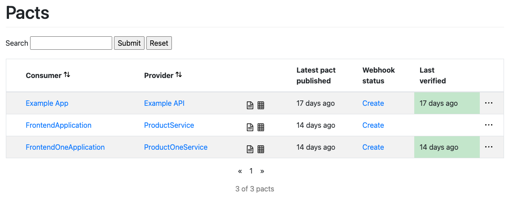

# Pact 개념

[소비자 주도 계약 이라는 개념에서 시작하였고 자세한 사항은 해당 페이지를 참고하세요!!](https://martinfowler.com/articles/consumerDrivenContracts.html)

[Pact 챕터1 MSA아키텍처 API 자동화 테스트 Contract Test Pact 오픈라이브러리 알아보기](https://angryfullstack.tistory.com/111)

#Pact JVM Consumer Unit 테스트 및 Broker Server Public 챕터3
참조링크 : [Pact JVM Consumer Unit 테스트 및 Broker Server Public 챕터3](https://angryfullstack.tistory.com/116)

# Pact JVM
공식문서 : [Pact Provider](https://docs.pact.io/implementation_guides/jvm/provider/junit5spring)


## Pact Sample Project Repository Github 저장소
[Java + Springboot 를 사용하는 워크샵에 단계는 아래와같습니다.](https://github.com/lswteen/pact-workshop-jvm-spring)

---

## Provider Unit Test 및 Status
이전 시간 "[챕터3](https://angryfullstack.tistory.com/116)" 에서 Consumer 역활을 하는 서버 Junit 단위테스트로 성공된 .Json DSL Pact파일을  
Broker Server로 Public 등록된것을 확인하였습니다.

Broker Server 에 등록된 Pact파일 Provider Unit Test로 검증을 진행하도록 하겠습니다



---
Consumer : FrontendOneApplication  
Provider : ProductOneService  
Given : products exist
---

## Pact Broker Server 
```text
Pact Broker는 Pact Contract Testing 프로세스에서 중요한 역할을 하는 중앙 저장소입니다.
Pact 파일(Consumer와 Provider간의 계약을 정의한 것)을 저장하고, 버전 관리하는 역할을 합니다.
Pact Broker를 통해 여러 서비스 간에 계약 정보를 공유하고, 각 서비스의 Pact 검증 상태를 추적할 수 있습니다.
```
## Provider Code 
```java
package au.com.dius.pactworkshop.provider;

import au.com.dius.pact.provider.junit5.PactVerificationContext;
import au.com.dius.pact.provider.junit5.PactVerificationInvocationContextProvider;
import au.com.dius.pact.provider.junitsupport.Provider;
import au.com.dius.pact.provider.junitsupport.State;
import au.com.dius.pact.provider.junitsupport.loader.PactBroker;
import au.com.dius.pact.provider.junitsupport.loader.PactBrokerAuth;
import au.com.dius.pact.provider.spring.junit5.MockMvcTestTarget;
import org.apache.http.HttpRequest;
import org.junit.jupiter.api.BeforeEach;
import org.junit.jupiter.api.TestTemplate;
import org.junit.jupiter.api.extension.ExtendWith;
import org.mockito.Mock;
import org.springframework.test.context.junit.jupiter.SpringExtension;
import org.springframework.test.web.servlet.MockMvc;
import org.springframework.test.web.servlet.ResultActions;
import org.springframework.test.web.servlet.request.MockMvcRequestBuilders;
import org.springframework.test.web.servlet.setup.MockMvcBuilders;

import java.util.Arrays;
import java.util.List;

import static org.mockito.Mockito.when;

@ExtendWith(SpringExtension.class)
@Provider("ProductOneService")
//@PactFolder("pacts")
@PactBroker(
        host = "localhost",
        port = "9292",
        authentication = @PactBrokerAuth(username = "jobkorea", password = "1111")
)
public class ProductPactOneProviderTest {

    @Mock
    private ProductRepository productRepository;

    ProductController productController;

    private MockMvc mockMvc;

    @BeforeEach
    void setUp(PactVerificationContext context) {
        productController = new ProductController(productRepository);
        mockMvc = MockMvcBuilders.standaloneSetup(productController)
                        .addInterceptors(new ContentTypeEnforcerInterceptor())
                                .build();
        context.setTarget(new MockMvcTestTarget(mockMvc));
    }

    @TestTemplate
    @ExtendWith(PactVerificationInvocationContextProvider.class)
    void verifyPact(PactVerificationContext context) {
        //replaceAuthHeader(request);
        try {
            ResultActions result = mockMvc.perform(MockMvcRequestBuilders.get("/products"));
            String responseBody = result.andReturn().getResponse().getContentAsString();
            System.out.println("responseBody : " + responseBody);
            context.verifyInteraction();
        } catch (Exception e) {
            e.printStackTrace();
        }

    }

    private void replaceAuthHeader(HttpRequest request) {
        if (request.containsHeader("Authorization")) {
            request.removeHeaders("Authorization");
            request.addHeader("Authorization", "Bearer 2086-10-31T22:52");
            request.addHeader("Content-Type","application/json; charset=UTF-8");
        }
    }


    @State("products exist")
    void toProductsExistState() {
        List<Product> response = Arrays.asList(
            new Product("09", "CREDIT_CARD", "Gem Visa", "v1")
            //new Product("09", "CREDIT_CARD", "Gem Visa", "v1")
        );

        when(productRepository.fetchAll()).thenReturn(response);


    }
}

```


