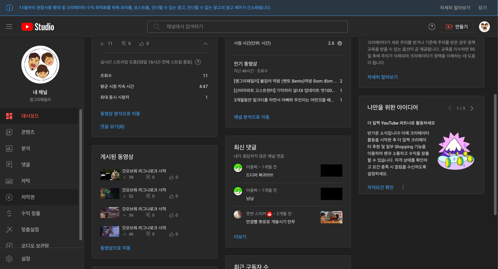
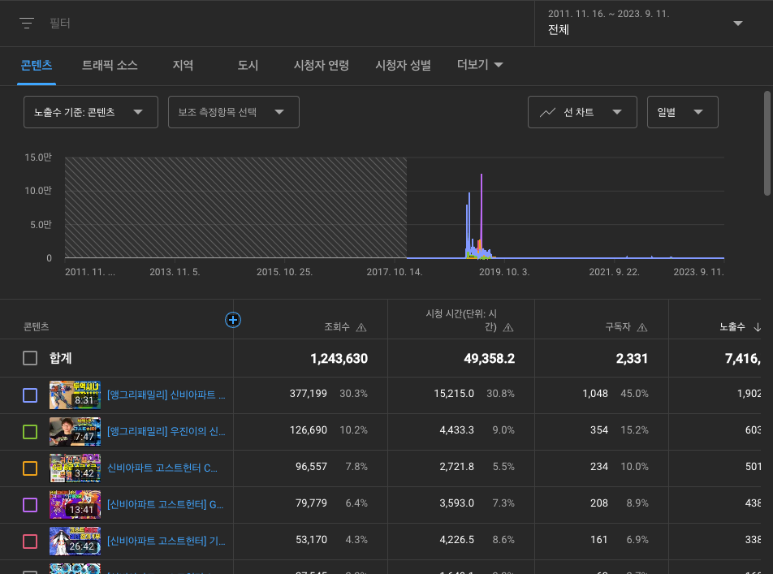
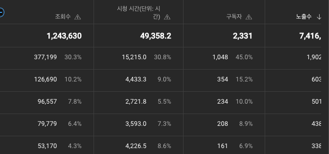
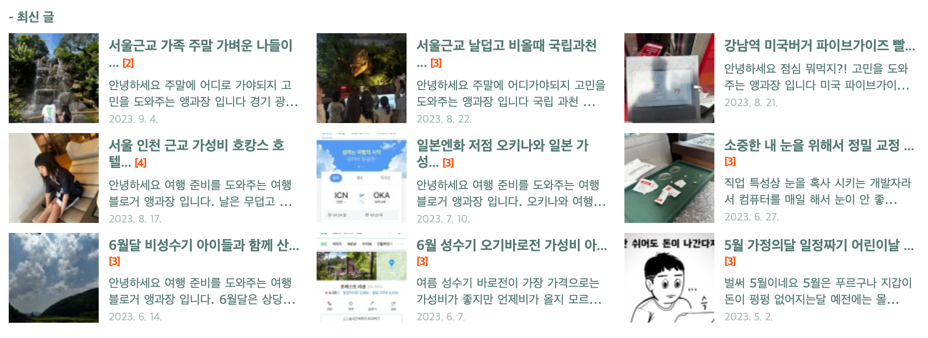
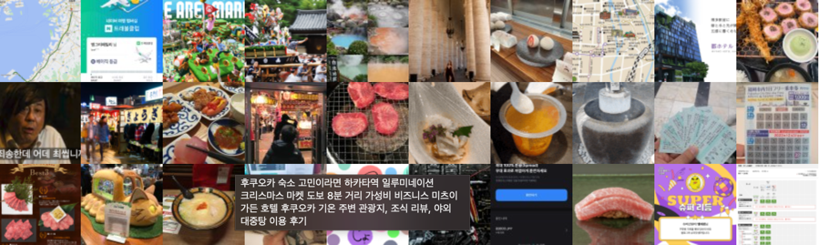
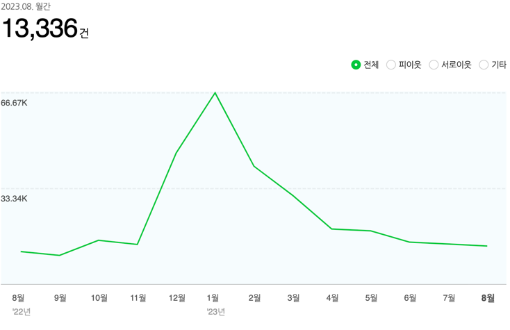
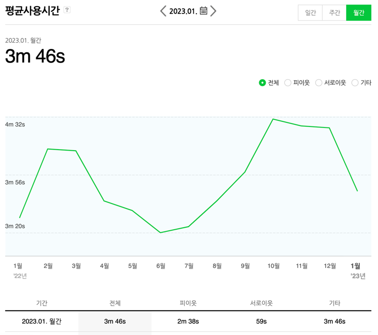

#Search Engine Optimization (검색 엔진 최적화)

SEO는 Google, Naver, Youtube, SNS 등 서비스 플랫폼에서 제공되고있는 검색엔진에 노출하고자 하는  
서비스 플랫폼, 블로그, 이커머스, 컨텐츠 등등등.. 랭킹을 올릴수 있는 다양한 방법을 최적화 하는 프로세스 입니다.

## 검색최적화 키워드 SEO, SEM, PPC
- SEO : 검색 엔진에서 유기적인 트래픽 유도
- SEM : 검색 엔진에서 유기적, 유료 트래픽 유도
- PPC : 클릭당 유도광고

## 다양한 서비스 플랫폼 SEO를 3-4 년째 삽질하며 느낀 내용을 기반으로 정리 합니다.
유튜브, 블로그, 전자책, 오픈마켓 등으로 어떻게하면 노출을 증가시키고 클릭을 유도하고 
타케팅으로 유도된 EndUser들이 내가 만든 컨텐츠에 지속시간이 증가되고 각 서비스 플랫폼에서 랭킹이 상위로 올라갈수있는 
행위 여러 작은 성공 실패등으로 느껴보던 내용을 정리해보는 시간이 필요한것 같아서 기록합니다.

- [구글 검색엔진 최적화](https://developers.google.com/search/docs/fundamentals/seo-starter-guide?hl=ko)
- [네이버 검색엔진 최적화](https://searchadvisor.naver.com/guide/seo-basic-intro)
- [유투브 컨텐츠 최적화](https://www.youtube.com/@youtubecreators)  

## Youtube 컨텐츠 랭킹 상위 노출 
```text
Youtbue 같은경우 가장 중요한 SEO항목은 
지속시간, 이탈률, 트랜드 주제, 연속성, 댓글, 좋아요 같은 내용인데

썸네일 + 제목이 컨텐츠의 주요내용을 잘보여주고 연관성있는 구성이 필수적인 요소인것 같습니다.
동일힌 시간대 업로드, 같은 카테고리에 속해있는 컨텐츠, 최근 실시간 조회수가 높은 키워드로 확인됩니다.

무엇보다 중요한건 꾸준한 지속력 그리고 하나의 컨텐츠가 알고리즘으로 높은 조회수가 올라갔을경우 
다른컨텐츠가 충분히 연속성있는 컨텐츠가 많이 누적되어있을경우 전체적인 조회수 상승과 팔로우가 증가됩니다.

좋은 컨텐츠는  특정기간 트랜드나 일회성 컨텐츠 보다 여러번 반복해서 찾아볼수있는 컨텐츠를 만드는것이 중요한 포인트 입니다.
재생 목록에 여러 편으로 연결된 시리즈 형태도 그중 하나입니다.
```





## NAVER Blog 컨텐츠 키워드 분석 및 상위 노출 방법
```text
네이버 블로그의 경우 
2003년 10월 13일 오픈 이후 수많은 과정을 통해서 네이버에서 누적된 컨텐츠로 많은 EndUser들이 정보를 찾는 서비스 플랫폼중 하나입니다.

초기 네이버에서 중반기 현재까지 많은 블로그가 만들어지고 성장하는과정에서 
화이트햇, 블랙햇 방식에 컨텐츠로 지속적인 SEO가 만들어진 상태입니다.

물론 !!
처음보다 수많은 광고, 어그로등으로 신뢰도 있는 정보를 필터링 해야하는 상황이지만 그럼에도 불구하고 많은 국내 이용자들이 사용하고 있는 중입니다.

네이버의 경우 최신성에 많인 포인트를 랭킹에 포함합니다.
구글의 경우에는 오랜시간 신뢰도가 누적되면 상위에 랭킹되지만 
네이버의 경우에는 수많은 광고, 어그로, 누적되는 데이터가 필요해서인지 구글만큼 오랫동안 상위 랭킹이 어려운것이 특징입니다.

아래 작성된 내용을 기반으로 블로그 지수가 만들어집니다.
블로그 지수 확인 가능한 사이트들은 검색해보시면 확인 가능합니다.

- 일주엘 4-5개의 블로그 포스팅
- 같은 주제
- 포스팅 글자수 2000자이상, 사진, 움직이는GIF, 영상포함 
- 메인키워드, 중소형 키워드, 핵심 키워드, 비인기 키워드, 트랜드 키워드 등으로 구성된 50자 이상의 제목
- 컨텐츠 글 지속시간
- 실시간 검색 키워드
- 인플루언서 선정
- 네이버 초기에 생성된 블로그


```





## NAVER 오픈마켓 쇼핑몰
```text
레드 오션 불모지 네이버 오픈마켓에서 경쟁이 되는
상품을 찾고 키워드를 분석하고 분석된 키워드로 다시 타켓을 찾아가는 반복되는 행위로 
네이버 SEO가 어떻게 돌아가는지 알수있던 경험입니다
```


##검색엔진 최적화(SEO) 기본 가이드

참조 링크 : https://developers.google.com/search/docs/fundamentals/seo-starter-guide?hl=ko

### 직관적 URI


```text
1) Query String으로 구성된 패턴
   https://프로이직러.co.kr/list?page=1
   https://프로이직러.co.kr/keyword?abc

2) Path Variable
   https://프로이직러.co.kr/list/1
   https://프로이직러.co.kr/keyword/abc

구글에서는 동일한 컨텐츠를제공하는 URI구성 정보라면 직관적 URI를 선호합니다.
```

### 문자, 숫자 URI
```text
티스토리에서는 아래와같이 URI를 숫자, 문자 2가지 방식으로 제공합니다.

숫자, 문자 또한 검색 SEO노출에 차이를 보이기때문에 이런부분도 고려해서 변경해보고 모니터링하면서 높아지는 우선순위 방법으로 진행하시면됩니다.

아무래도 한글 Text경우 경험상 SEO 수치가 좋아지는 느낌은 아닙니다.
물론 검색하는 End User 타켓이 한국일경우 예외입니다.

무조건 문자가 좋다 숫자가 좋다보다는 이부분도 Case를 고려해서 적용이 필요합니다.
```

### URI Depth
```text
단순 디렉토리 구조

아래 2링크모두 원픽!!
어떤링크를 주타켓 링크로 할껀지 ...

https://www.abc.co.kr/user/info
https://www.abc.co.kr/user/info?Page=1&PageSize=20&Ord=task-01

URI에 /.../.../.../... 최대한 Depth를 들어가지 않도록 전달될수있는 구성으로 최소화하여 SEO에 노출된 도메인 랭킹 상승으로
```

### Sub Domain VS Sub Folder

#### 서브도메인 예시:
- news.performars.com
- blog.performars.com 
- event.performars.com

서브 도메인은 각각의 도메인이므로 새로운 토픽을 관리할 때 사용됩니다.
SEO 점수가 호스트 도메인에 흡수가 되지 않는다는 견해도 존재합니다.
Call to action 있는 랜딩 페이지 하나만 관리하고 싶으면 서브도메인이 편리합니다. ( 예: Hubspot)
하지만 서비스 용도별로 많은 sub가 구성될경우 관리 복잡도가 증가합니다.

#### 서브폴더 예시: 
- performars.com/news
- performars.com/blog
- performars.com/event

서브 폴더는 여러 서비스들을 호스트 도메인 아래로 연결 시켜서 관리하는 구조입니다.
여러 서브 폴더는 하나의 호스트 도메인에 속해 있는 SEO 점수가 루트 도메인으로 흡수된다고 합니다.
서브 폴더의 내용은 주로 전달하고자하는 의도가 명확히 들어간 도메인과 연관성이 강하게 있으면 좋다고 합니다.
관리가 편하다 SEO ranking 을 위해서는 서브폴더가 유리할 수 있다
랭킹상승 목적이라면 서브폴더를 추천드립니다.

### Sitemap

사이트맵이란 웹사이트에서 구글이나 네이버와 같은 검색 엔진에 색인할 모든 페이지를 나열한 XML 파일로,
웹사이트에 방문하는 검색엔진 크롤러에게 지도와 같은 역할을 합니다.
다시 말해 사이트맵은 색인이 되어야 할 모든 페이지의 목록을 제공함으로써 검색엔진 크롤러가 발견하는데
어려움을 겪는 페이지도 문제없이 크롤링되고 색인될 수 있게 해주는 파일이라고 이해할 수 있습니다.

아래 URI에서 google Search Console 에 들어가는 .xml을 생성하며
만들어지는 기준은 마케팅 통계 기반데이터를 구성으로 생성되어야 합니다.

- https://www.xml-sitemaps.com/
- https://www.screamingfrog.co.uk/seo-spider/


### 화이트햇 방식
```text
양질의 콘텐츠를 제작해 사람들에게 ‘가치 있는 정보’를 제공하 는 블로그 운영 방식을 말합니다.
양질의 콘텐츠는 사람들의 고민을 해결해주고,
블로그 내 다른 콘텐츠들까지 소비하게 만들어 결국, 체류시간은 높고 이탈률이 매우 낮은 이상 적인 블로그 운영이 가능합니다.
포털상위노출은 덤입니다.

특히, 구글은 아직 외국처 럼 상위노출이 빡세지 않아서 화이트햇 운영만으로도 상위노출을 노릴 수 있습니다
```
양질의 좋은 컨텐츠는 평균시간 1:30초 이상 (2200자+이미지+숏영상+움직이는이미지+신뢰도 높은 검증된 링크 포함) 소요 하면서 페이지뷰수가 올라갑니다.   
그만큼 타켓유저가 증가하는데

보통의 좋지않은 컨텐츠의 경우는 이탈율이 높아집니다.  
평균 50프로 이상이며 70-80프로 가 대부분입니다.

아래 컨텐츠는 EndUser가 들어왔을때 필요로 하는 양질의 컨텐츠를  
제공하기에 이탈율이 거의 1프로 미만으로 유지되는 컨텐츠를 의미합니다.

### 화이트햇 사이트
```text
https://the-edit.co.kr/
https://the-edit.co.kr/55557
```

### 블랙햇 방식
블랙햇 방식은 화이트햇과 정반대의 방식으로 누적되는 시간으로 올리기보다는 다양한 잔기술로 컨텐츠를 끌어올리는 방식을 말합니다.

블랙햇의 경우 가치있는 정보를 실시간 이슈되는 화제 키워드 자극적인 이미지로 클릭을 유도하게됩니다.  
조회수가 시간대비 빠르게 올라갈수는 있지만 지속시간이나 단발성 자극키워드로 인해서 연속성이 있는 컨텐츠를 보여주는것이 쉽지 않습니다.  
잘못하면 신뢰도가 떨어지는 사이트로 만들어질수 있게됩니다.


```text
2020.06.02 : 코로나19, 명품 재고 세일 
조회수 : 9551 
반응시간 : 1일
이때 youtube에서 발란에서 재고관련 유투브로 쿠폰을 뿌리면서 명품을 싸게 살수있는 방법이 실시간 트랜드 이슈되면서
바로 연결해서 작성한 블로그 입니다.

2020.07.21 : 현대차 수소 테슬라 니콜라
조회수 : 2,309
반응시간 : 1일
테슬라, 니콜라 주식이 엄청나게 몰리면서 트랜드 이슈되는 키워드를 뽑아서 작성한 블로그

2020.07.27 : 노르디스크 콜라보 던킨도너츠
조회수 : 2620
반응시간 : 1일
코로나 시기 던킨도너츠, 스타벅스등 다양한 캠핑용품 콜라보 시기 키워드를 잡아서 작성한 블로그

2020.08.04 : 애주가TV 참PD 유투브 뒷광고 이슈로 인한 키워드
조회수 : 1만 이상
반응시간 : 1일
유투브 뒷광고 키워드 내용은 별게 없음
```
이렇게 키워드 실시간 조합으로 조회수는 끌어올릴수있지만 오랜시간 지속도 힘들분더라 블로그 카테고리가 중구난방입니다.
단시간 이슈는될수있지만 방향성이 모호해지기 때문에 비추드립니다.

물론 본인과 맞는 카테고리 실시간 키워드를 잘잡아서 올리는것은 좋은방법이 될수있습니다.

### HTML5 SEO 요소

#### title
각 페이지의 제목을 정의하는 데 사용됩니다.
페이지 제목은 검색 결과에서 표시되며, 페이지 콘텐츠의 핵심 키워드를 포함해야 합니다.
```html
<head>
  <title>페이지 제목</title>
</head>

```
#### meta
<meta> 요소를 사용하여 페이지의 메타 정보를 정의할 수 있습니다.
<meta name="description">은 페이지에 대한 간단한 설명을 제공하며 검색 결과에 표시됩니다.
<meta name="keywords">는 페이지의 주요 키워드나 태그를 정의합니다.

```html
<head>
  <meta name="description" content="페이지에 대한 간단한 설명">
  <meta name="keywords" content="키워드1, 키워드2, 키워드3">
</head>
```

#### h1 ~ h6
제목(헤딩) 요소는 페이지의 구조를 나타내는 중요한 역할을 합니다.
h1은 가장 중요한 제목을 나타내며, 하위 섹션의 제목은 h2 에서 h6 까지 사용합니다.

```html
<h1>제목 1</h1>
<h2>제목 2</h2>
<h3>제목 3</h3>
<!-- ... -->
<h6>제목 6</h6>

```

#### img
이미지를 포함하는 경우, img 요소의 alt 속성을 사용하여 이미지에 대한 설명을 제공해야 합니다.
검색 엔진은 이미지 설명을 이용하여 이미지 검색 결과를 향상시킬 수 있습니다.

```html


```

#### a
하이퍼링크(a) 요소는 다른 페이지로 연결하는 데 사용됩니다.
링크 텍스트를 잘 정의하고, 관련된 페이지로 연결하여 사용자와 검색 엔진이 내용을 이해하기 쉽게 만듭니다.

```html
<a href="링크URL">링크 텍스트</a>
```

#### header 와 footer
header와 footer 요소는 페이지 상단과 하단에 위치하며, 페이지의 주요 콘텐츠를 감싸는 역할을 합니다.
검색 엔진은 이러한 요소를 사용하여 페이지의 구조를 이해하고 콘텐츠의 중요성을 파악할 수 있습니다.

```html
<header>
  <!-- 헤더 내용 -->
</header>

<!-- 페이지 내용 -->

<footer>
  <!-- 푸터 내용 -->
</footer>

```

#### nav
nav 요소는 사이트 내비게이션 메뉴를 정의하는 데 사용됩니다.
이것은 검색 엔진이 사이트 내의 중요한 링크와 섹션을 식별하는 데 도움이 됩니다.

```html
<nav>
  <ul>
    <li><a href="/">홈</a></li>
    <li><a href="/페이지1">페이지1</a></li>
    <li><a href="/페이지2">페이지2</a></li>
    <!-- ... -->
  </ul>
</nav>
```

### Canonical
Canonical 태그 또는 rel="canonical"은 검색 엔진 최적화 (SEO)에서 중요한 역할을 하는 HTML 요소입니다.  
이 태그는 중복 컨텐츠의 문제를 해결하고 검색 엔진에게 어떤 페이지가 원본(주요) 페이지임을 알려주는 역할을 합니다.   
Canonical 태그가 하는 역할은 다음과 같습니다:  

중복 컨텐츠 해결: 
웹 사이트에서 동일한 또는 거의 동일한 콘텐츠가 여러 페이지에 나타날 수 있습니다. 
예를 들어, 제품 카탈로그 페이지의 정렬 순서가 바뀐 버전, 페이징된 페이지, 
모바일 버전 등이 있을 수 있습니다. 이렇게 중복된 페이지는 검색 엔진에게 혼란을 줄 수 있고, 
페이지 랭킹에 부정적인 영향을 미칠 수 있습니다.

주요 페이지 지정: 
Canonical 태그를 사용하면 여러 중복 페이지 중에서 어떤 페이지가 원본(주요) 페이지로 간주되어야 하는지를 지정할 수 있습니다.
검색 엔진은 이 정보를 활용하여 주요 페이지를 인식하고 인덱싱합니다.

검색 엔진 랭킹 향상:
중복 컨텐츠 문제를 해결하고 주요 페이지를 지정함으로써 검색 엔진 랭킹을 향상시킬 수 있습니다. 
중복된 페이지가 서로 경쟁하지 않고, 주요 페이지로 집중되기 때문입니다.

```html
<link rel="canonical" href="https://example.com/주요-페이지">

```
이것은 https://example.com/주요-페이지가 주요 페이지이며, 다른 중복 페이지들은 이 페이지를 따르라는 것을 나타냅니다.

주의해야 할 점:

Canonical 태그는 주요 페이지와 중복 페이지 간의 관계를 정확하게 나타내야 합니다.
Canonical 태그는 주요 페이지의 <head> 섹션에 위치해야 합니다.
중복 페이지가 정말로 동일한 내용을 가지는지 확인해야 합니다. 서로 다른 콘텐츠를 가진 경우, Canonical 태그를 사용하면 안 됩니다.
중복 페이지를 완전히 제거하거나 로봇 메타 태그로 크롤링을 방지하는 것이 더 나은 해결책일 수 있습니다.
Canonical 태그는 검색 엔진 최적화에 중요한 역할을 하며, 중복 컨텐츠 관리와 웹 사이트의 랭킹 향상을 위해 주로 사용됩니다.

### robots
robots.txt 파일은 검색 엔진 최적화 (SEO)에서 중요한 역할을 하는 텍스트 파일입니다.   
이 파일은 웹 사이트의 루트 디렉터리에 위치하며, 검색 엔진 크롤러에게 웹 페이지를 어떻게 크롤링하고 인덱싱해야 하는지 지시하는 역할을 합니다.  
robots.txt 파일의 역할은 다음과 같습니다:  

```txt
크롤러 제어: robots.txt 파일은 웹 사이트에 대한 검색 엔진 크롤러의 접근 권한을 제어하는 데 사용됩니다.
 이 파일을 사용하면 특정 디렉터리 또는 페이지를 크롤링하지 않도록 크롤러에 지시할 수 있습니다.

중요한 페이지 강조: 웹 사이트의 중요한 페이지를 크롤러에게 강조하고 우선적으로 크롤링하도록 지시할 수 있습니다. 
이는 검색 엔진에서 중요한 콘텐츠를 더 빠르게 인덱싱하고 랭킹에 반영하는 데 도움을 줍니다.

보안 및 개인 정보 보호: robots.txt 파일을 사용하여 개인 정보가 포함된 페이지나 보안에 민감한 페이지를 크롤링하지 않도록 설정할 수 있습니다.

불필요한 크롤링 방지: 검색 엔진 크롤러가 불필요하게 중복되거나 무의미한 페이지를 크롤링하지 않도록 설정할 수 있습니다. 
이로써 웹 사이트의 대역폭을 절약하고 리소스를 효율적으로 활용할 수 있습니다.

부적절한 콘텐츠 숨김: robots.txt 파일을 사용하여 부적절한 콘텐츠가 포함된 페이지를 검색 엔진 크롤러로부터 숨길 수 있습니다.

robots.txt 파일은 웹 사이트의 루트 디렉터리에 위치해야 하며, 특정 크롤러에 대한 지시를 설정하는 방법은 다음과 같습니다:

User-agent: 크롤러의 이름이나 식별자를 지정합니다. 
예를 들어, Googlebot, Bingbot, 또는 * (와일드카드) 등을 사용할 수 있습니다.
Disallow: 특정 디렉터리나 페이지를 크롤링에서 제외할 때 사용합니다.
Allow: Disallow와 함께 사용하여 특정 디렉터리나 페이지를 제외하되 예외적으로 크롤링을 허용할 때 사용합니다.
Sitemap: 웹 사이트의 사이트맵 파일의 경로를 지정하여 검색 엔진에게 사이트맵을 제공할 수 있습니다.
```

예를 들어, 다음은 모든 크롤러에 대해  
/private/ 디렉터리를 크롤링하지 말라고 지시하는 robots.txt 파일의 내용입니다:

```html
User-agent: *
Disallow: /private/

```

### meta 태그 설명

```html
<meta property="og:url" content="https://www.inflearn.com/">
<meta property="og:type" content="website">
<meta property="og:title" content="인프런 - 라이프타임 커리어 플랫폼">
<meta property="og:description" content="프로그래밍, 인공지능, 데이터, 마케팅, 디자인, 엑셀 실무 등 입문부터 실전까지 업계 최고 선배들에게 배울 수 있는 곳. 우리는 성장 기회의 평등을 추구합니다.">
<meta property="og:image" content="https://cdn.inflearn.com/assets/brand/inflearn-brand.jpg">
<meta property="og:image:secure_url" content="https://cdn.inflearn.com/assets/brand/inflearn-brand.jpg">
<meta property="og:site_name" content="인프런">
<meta property="og:locale" content="ko-KR">
```
#### 각 태그속성 설명
```html
<meta property="og:url" content="https://www.inflearn.com/">

이 메타 태그는 페이지의 URL을 정의합니다.
SEO 관점에서는 페이지의 정확한 주소를 지정하여 검색 엔진과 소셜 미디어 플랫폼이 페이지를 식별하고 적절하게 색인화할 수 있도록 도와줍니다.
<meta property="og:type" content="website">

이 메타 태그는 웹 페이지의 유형을 나타냅니다. "website"는 웹 사이트를 나타냅니다.
소셜 미디어 플랫폼은 이 정보를 사용하여 페이지의 유형을 이해하고 미리보기 및 공유 시 적절한 형식으로 표시할 수 있습니다.
<meta property="og:title" content="인프런 - 라이프타임 커리어 플랫폼">

이 메타 태그는 웹 페이지의 제목을 나타냅니다.
SEO 관점에서는 페이지의 주요 제목을 제공하여 검색 엔진과 소셜 미디어 플랫폼에서 페이지의 주제를 이해하고 사용자에게 표시할 때 유용합니다.
<meta property="og:description" content="프로그래밍, 인공지능, 데이터, 마케팅, 디자인, 엑셀 실무 등 입문부터 실전까지 업계 최고 선배들에게 배울 수 있는 곳. 우리는 성장 기회의 평등을 추구합니다.">

이 메타 태그는 웹 페이지의 간단한 설명 또는 요약을 나타냅니다.
SEO 관점에서는 페이지의 내용을 간략하게 설명하여 검색 엔진 및 소셜 미디어에서 페이지를 검색 결과에 표시할 때 사용합니다.
<meta property="og:image" content="https://cdn.inflearn.com/assets/brand/inflearn-brand.jpg">

이 메타 태그는 웹 페이지와 관련된 이미지의 URL을 정의합니다.
SEO 관점에서는 페이지와 관련된 이미지를 제공하여 소셜 미디어에서 페이지를 더 시각적으로 표시할 수 있으며, 이미지 검색 결과에 표시할 수 있습니다.
<meta property="og:image:secure_url" content="https://cdn.inflearn.com/assets/brand/inflearn-brand.jpg">

보안된 HTTPS 경로에서 이미지를 가져오도록 소셜 미디어에 지시하는 메타 태그입니다.
<meta property="og:site_name" content="인프런">

이 메타 태그는 웹 사이트의 이름을 나타냅니다.
SEO 관점에서는 웹 사이트의 이름을 제공하여 소셜 미디어에서 웹 페이지의 출처를 인식하고 사용자에게 표시할 때 도움을 줍니다.
<meta property="og:locale" content="ko-KR">

이 메타 태그는 웹 페이지의 언어 또는 로캘을 나타냅니다.
SEO 관점에서는 웹 페이지의 언어를 지정하여 검색 엔진과 소셜 미디어 플랫폼이 페이지를 적절하게 랭킹하고 사용자에게 표시할 때 언어를 고려할 수 있도록 도움을 줍니다.
```
#### 각 태그 속성 

```html
<!-- twitter og tag START  -->
<meta name="twitter:card" content="summary">
<meta name="twitter:title" content="인프런 - 라이프타임 커리어 플랫폼">
<meta name="twitter:description" content="프로그래밍, 인공지능, 데이터, 마케팅, 디자인, 엑셀 실무 등 입문부터 실전까지 업계 최고 선배들에게 배울 수 있는 곳. 우리는 성장 기회의 평등을 추구합니다.">
<meta name="twitter:image" content="https://cdn.inflearn.com/assets/brand/inflearn-brand.jpg">
<meta name="twitter:url" content="https://www.inflearn.com/">
<meta name="twitter:site" content="@inflearn">
<meta name="twitter:creator" content="@inflearn">

<meta name="twitter:card" content="summary">
이 메타 태그는 Twitter 카드 유형을 정의합니다. "summary" 값은 기본적인 카드 스타일로 페이지의 제목, 설명 및 이미지를 표시합니다.
Twitter 카드는 웹 페이지를 Twitter에서 공유할 때 해당 페이지의 미리보기를 정의합니다.
<meta name="twitter:title" content="인프런 - 라이프타임 커리어 플랫폼">

이 메타 태그는 Twitter 카드의 제목을 정의합니다.
페이지를 Twitter에서 공유할 때, 이 제목이 미리보기에 포함됩니다.
<meta name="twitter:description" content="프로그래밍, 인공지능, 데이터, 마케팅, 디자인, 엑셀 실무 등 입문부터 실전까지 업계 최고 선배들에게 배울 수 있는 곳. 우리는 성장 기회의 평등을 추구합니다.">

이 메타 태그는 Twitter 카드의 설명을 정의합니다.
페이지를 Twitter에서 공유할 때, 이 설명이 미리보기에 포함됩니다.
<meta name="twitter:image" content="https://cdn.inflearn.com/assets/brand/inflearn-brand.jpg">

이 메타 태그는 Twitter 카드와 함께 표시할 이미지의 URL을 지정합니다.
페이지를 Twitter에서 공유할 때, 이 이미지가 미리보기에 표시됩니다.
<meta name="twitter:url" content="https://www.inflearn.com/">

이 메타 태그는 Twitter 카드의 웹 페이지 URL을 정의합니다.
페이지를 Twitter에서 공유할 때, 이 URL이 공유에 포함됩니다.
<meta name="twitter:site" content="@inflearn">

이 메타 태그는 Twitter 카드를 발송한 웹 사이트 또는 앱의 Twitter 계정을 지정합니다.
웹 페이지가 Twitter으로 공유될 때, 이 계정 정보가 표시됩니다.
<meta name="twitter:creator" content="@inflearn">

이 메타 태그는 웹 페이지를 만든 개별 사용자 또는 작성자의 Twitter 계정을 지정합니다.
페이지가 Twitter으로 공유될 때, 이 작성자의 계정 정보가 표시됩니다.
<!-- twitter og tag END -->
```

#### SEO head > Best Practice HTML Sample

```html
<!DOCTYPE html>
<html lang="en">
<head>
    <meta charset="UTF-8">
    <meta http-equiv="X-UA-Compatible" content="IE=edge">
    <meta name="viewport" content="width=device-width, initial-scale=1.0">

    <!DOCTYPE html>: HTML5 문서 유형을 지정합니다.
    <html lang="en">: HTML 문서 시작을 나타냅니다. lang 속성은 페이지의 언어를 지정하는 데 사용됩니다.
    <head>: 웹 페이지의 헤더를 시작합니다. 여기에는 문서의 메타 정보와 다른 중요한 요소들이 들어갑니다.
    
    <!-- 기본 SEO 메타 태그 -->
    <title>페이지 제목</title>
    <meta name="description" content="페이지 설명">
    <meta name="keywords" content="키워드1, 키워드2, 키워드3">
    <meta name="author" content="저자 이름">
    <!--    
    <title>: 웹 페이지의 제목을 정의합니다. 브라우저 탭에 표시되는 텍스트입니다.
    <meta name="description" content="페이지 설명">: 웹 페이지의 간단한 설명을 정의합니다. 검색 결과 페이지에 표시됩니다.
    <meta name="keywords" content="키워드1, 키워드2, 키워드3">: 웹 페이지와 관련된 키워드를 정의합니다. 검색 엔진에는 큰 영향을 주지 않으나, 메타 키워드로서 사용될 수 있습니다.
    <meta name="author" content="저자 이름">: 웹 페이지의 저자 또는 작성자를 나타냅니다.
    -->
        
    <!-- 검색 엔진에 대한 페이지 색인화 관련 메타 태그 -->
    <meta name="robots" content="index, follow"> <!-- 기본값으로 설정됨 -->
    <meta name="googlebot" content="index, follow"> <!-- 구글 검색 엔진 색인화 관련 메타 태그 -->

    <!--    
    <meta name="robots" content="index, follow">
        : 검색 엔진 크롤러에게 페이지를 색인화하고 따르도록 지시합니다. 기본값으로 설정되어 있어서 보통 추가할 필요는 없습니다.
        
    <meta name="googlebot" content="index, follow">
        : 구글 검색 엔진 크롤러에게 페이지를 색인화하고 따르도록 지시합니다.
    -->    
    
    <!-- 소셜 미디어 공유 관련 메타 태그 -->
    <!-- 페이스북 -->
    <meta property="og:url" content="https://www.example.com/">
    <meta property="og:type" content="website">
    <meta property="og:title" content="페이지 제목">
    <meta property="og:description" content="페이지 설명">
    <meta property="og:image" content="https://www.example.com/images/thumbnail.jpg">
    <meta property="og:image:secure_url" content="https://www.example.com/images/thumbnail.jpg">
    <meta property="og:site_name" content="사이트 이름">
    <meta property="og:locale" content="ko_KR">
    
    <!--    
    공유되는 컨텐츠를 블로그에 URI 주소 붙여넣으면 만들어지게되는 이미지 썸네일 및 내용     
    이 부분은 Facebook의 Open Graph Protocol 메타 태그입니다. 페이지가 Facebook에서 공유될 때 사용됩니다. 각 속성은 다음을 나타냅니다:
    og:url: 페이지의 URL
    og:type: 페이지의 유형 (일반적으로 "website")
    og:title: 페이지 제목
    og:description: 페이지 설명
    og:image: 페이지와 관련된 이미지의 URL
    og:image:secure_url: 이미지의 보안된 HTTPS 경로
    og:site_name: 사이트 이름
    og:locale: 페이지 언어 및 로캘  
    -->    
        
    <!-- 트위터 -->
    <meta name="twitter:card" content="summary_large_image">
    <meta name="twitter:title" content="페이지 제목">
    <meta name="twitter:description" content="페이지 설명">
    <meta name="twitter:image" content="https://www.example.com/images/thumbnail.jpg">
    <meta name="twitter:url" content="https://www.example.com/">
    <meta name="twitter:site" content="@사이트_트위터_계정">
    <meta name="twitter:creator" content="@작성자_트위터_계정">

    <!--    
    이 부분은 Twitter 카드 관련 메타 태그입니다. 페이지가 Twitter에서 공유될 때 사용됩니다. 각 속성은 다음을 나타냅니다:
    twitter:card: Twitter 카드 유형 (예: "summary_large_image"는 큰 이미지 카드)
    twitter:title: 페이지 제목
    twitter:description: 페이지 설명
    twitter:image: 페이지와 관련된 이미지의 URL
    twitter:url: 페이지의 URL
    twitter:site: 사이트의 Twitter 계정
    twitter:creator: 페이지의 작성자 또는 저자의 Twitter 계정  
    -->    
        
    <!-- 틱톡 -->
    <!-- 틱톡은 메타 태그를 지원하지 않을 수 있습니다. -->
    
    <!-- 기타 소셜 미디어 플랫폼에 필요한 메타 태그를 추가할 수 있습니다. -->
    
    <!-- 기타 필요한 스타일 시트, 스크립트 등의 요소를 포함할 수 있습니다. -->
</head>
<body>
    <!-- 웹 페이지 본문 내용 -->
</body>
</html>

```